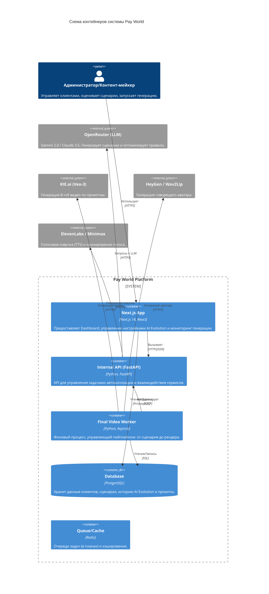

# Архитектура системы (C4 Container Diagram)

Проект построен по модульной архитектуре, где пользовательский интерфейс и сервисы автоматизации разделены, но работают с общей базой данных PostgreSQL.

## 🏗 Ключевые компоненты

### 1. Web UI (Dashboard)
- **Путь**: `/ui`
- **Технологии**: React, Tailwind, Lucide Icons.
- **Особенности**: 
    - Динамический расчет покрытия перебивок.
    - Интерфейс отката версий промптов (AI Evolution History).
    - Система предпросмотра визуальных промптов перед генерацией.

### 2. Automation Engine
- **Путь**: `/services/v1/automation`
- **Логика**: Обрабатывает этапы `scenario`, `waiting_kie`, `avatar_submit`, `montage`.
- **Отказоустойчивость**: Реализована система автоматических ретраев при сбоях ИИ-провайдеров (KIE API 422/500).

### 3. AI Evolution Service
- **Путь**: `/ui/src/lib/optimize-prompts-service.ts`
- **Механика**: 
    - Каждые N дизлайков (с комментарием > 20 символов) триггерят LLM для анализа ошибок.
    - LLM создает "Learned Rules" (Выученные правила), которые подмешиваются в системный промпт.
    - Поддержка версионности и мгновенного Rollback.

### 4. Video Post-processing (Post-production)
- **Path**: `/services/v1/post_production`
- **Функции**:
    - Наложение субтитров.
    - Динамический зум (Zoom In/Out) на аватара для создания динамики.
    - Обработка аудио (удаление тишины и вдохов).
