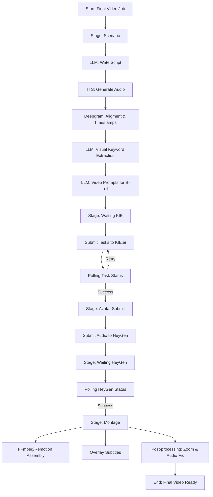

# Пайплайн автоматизации генерации видео

Этот документ описывает жизненный цикл создания видеоролика в системе Pay World — от идеи до финального файла.

## 🔄 Схема пайплайна (Workflow)

## 📝 Детальное описание этапов

### 1. Этап Scenario (Подготовка)
Система работает в нескольких режимах:
- **Mix**: Соединение случайной темы (Topic Card) и структуры (Structure Card).
- **Rewrite**: Переписывание существующего референса (из `telethon` парсера) под оффер клиента.
- **Cluster**: Анализ группы референсов для вычленения общих черт.

**Результат**: Сценарий, аудиофайл озвучки и JSON с временными метками слов.

### 2. Этап Waiting KIE (Визуал)
На основе ключевых сегментов сценария генерируются промпты для Veo-3.
- **Технология**: KIE.ai (модель Veo-3).
- **Логика ретраев**: Если сервис возвращает 422 (ошибка валидации промпта), система автоматически пробует перегенерировать промпт. Ограничение — 3 попытки.

### 3. Этап Avatar Submit (Аватар)
Система отправляет аудиофайл озвучки в HeyGen.
- Используется фиксированный `avatar_id` и `look_id` клиента.
- Если TTS файл отсутствует (сбой на шаге 1), система попытается регенерировать его перед отправкой.

### 4. Этап Montage (Сборка)
Финальный этап, выполняемый эндпоинтом `/api/scenarios/assemble`.
- **Composite**: Наложение аватара на фон или кадрирование.
- **B-roll Overlay**: Наложение сгенерированных видео-перебивок поверх аватара в нужные моменты времени.
- **Yandex Disk**: Загрузка готового ролика в облако клиента.

## 🛠 Управление через Worker
За весь процесс отвечает `final_video_worker.py`. Он работает по принципу конечного автомата (State Machine), переключая `current_stage` в таблице `final_video_jobs`. 

Если одна из стадий падает (например, нет коннекта к KIE), воркер делает экпоненциальную паузу (backoff) и пробует снова.
