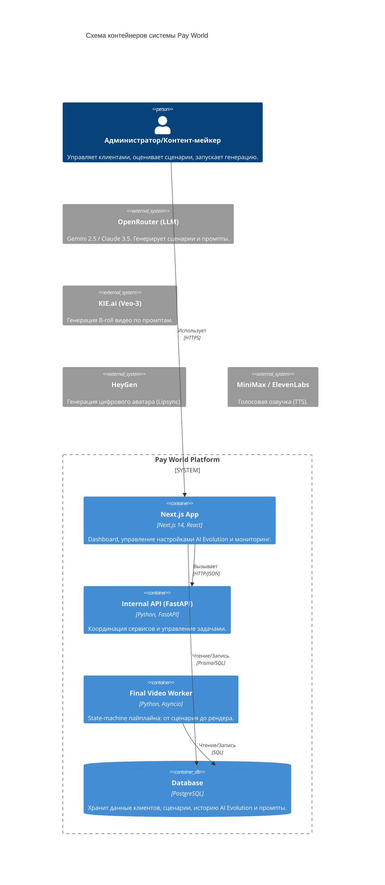

# 🌐 Контент машина (Content Machine)

[](https://github.com/vibetram/pay-world)
[](#-технологический-стек)

**Контент машина** — это высокоавтоматизированная платформа для генерации рекламного видеоконтента с использованием ИИ аватаров и динамических B-roll перебивок. Система автоматизирует полный цикл: от анализа референсов и написания сценариев до генерации аватаров и финального монтажа.

---

## 🎯 Ключевые возможности

- **AI Scenario Generation**: Создание сценариев на основе Tone of Voice клиента и паттернов успешных референсов.
- **AI Evolution (Самообучение)**: Промпты автоматически улучшаются на основе обратной связи пользователей (Learned Rules).
- **Multi-Provider TTS**: Поддержка ElevenLabs и MiniMax (оптимизировано для русского языка).
- **Automated Video Assembly**: Автоматический монтаж в Remotion/FFmpeg: аватар + перебивки + субтитры + динамический зум.
- **Multi-Avatar System**: Управление базой аватаров и их закрепление за конкретными офферами.

---

## 🏗 Архитектура системы

Система построена на модульном принципе: UI на Next.js и бэкенд-сервисы на FastAPI работают с общей базой данных PostgreSQL.



### Основные компоненты:
1. **Web UI**: `/ui` — Интерфейс управления, расчет покрытия перебивок и Rollback промптов.
2. **Automation Engine**: `/services/v1/automation` — Логика этапов `scenario`, `waiting_kie`, `avatar_submit`.
3. **AI Evolution**: Динамическое обучение на основе дизлайков (автогенерация "Learned Rules").
4. **Post-production**: `/services/v1/post_production` — Наложение субтитров, зум-эффекты и чистка аудио.

---

## 🔄 Пайплайн генерации (Workflow)

Процесс создания ролика управляется `final_video_worker.py` через систему состояний (State Machine):

1. **Scenario**: LLM пишет сценарий → TTS генерирует аудио → Deepgram дает тайминги → LLM выделяет ключевые слова.
2. **Waiting KIE**: Генерация B-roll видео (Veo-3) на основе промптов с логикой ретраев (до 3 попыток).
3. **Avatar Submit**: Отправка аудио в HeyGen для создания аватара.
4. **Waiting HeyGen**: Ожидание готовности аватара (Polling).
5. **Montage**: Сборка в FFmpeg → Субтитры → Кадрирование → Загрузка в Yandex Disk.

## 🚦 Очередь Финальных Роликов И Нагрузка

Контур финальной генерации работает через таблицу `final_video_jobs` и три независимых процесса:

1. `final_video_scheduler.py` — ставит новые job в очередь.
2. `final_video_worker.py` — обрабатывает активные стадии (`scenario`, `avatar_submit`, `montage`).
3. `final_video_poller.py` — опрашивает ожидания (`waiting_kie`, `waiting_heygen`).

### Модель Job И Стадии

У job есть ключевые поля:
- `status`: `queued` → `processing` → `completed|failed`
- `current_stage`: `scenario` → `waiting_kie` → `avatar_submit` → `waiting_heygen` → `montage`
- `attempt_count` / `max_attempts` (по умолчанию `6`)
- `scheduled_for` (отложенный запуск), `lease_until`, `worker_id`, `last_error`

### Как Ограничивается Нагрузка

Scheduler ставит job в очередь только при соблюдении всех гейтов:
- включена автогенерация: `clients.auto_generate_final_videos = true`
- дневной и месячный лимиты клиента (`daily_final_video_limit`, `monthly_final_video_limit`)
- лимит бэклога очереди на клиента (`FINAL_VIDEO_QUEUE_BACKLOG_PER_CLIENT`)
- лимит добавления за цикл (`FINAL_VIDEO_SCHEDULER_BATCH_PER_CLIENT`)

Важно: используются **strict gates по уже созданным job** (`final_video_jobs`), а не только по успешно завершенным роликам. Это защищает от бесконечного донасыщения очереди при внешних сбоях (KIE/HeyGen).

### Параллелизм И Fair Scheduling

Выбор следующей job идет через SQL `FOR UPDATE SKIP LOCKED` и сортировку:
- сначала клиенты с меньшим числом активных `processing` job
- затем `priority DESC`, потом `scheduled_for ASC`

Параллелизм ограничивается параметром:
- `FINAL_VIDEO_PER_CLIENT_CONCURRENCY` (по умолчанию `1`)

Это предотвращает ситуацию, когда один клиент выедает весь пул воркеров.

### Lease, Recovery И Ретраи

Для каждой взятой job ставится lease:
- worker lease: `FINAL_VIDEO_WORKER_LEASE_SECONDS` (по умолчанию `3600`)
- poller lease: `FINAL_VIDEO_POLLER_LEASE_SECONDS` (по умолчанию `600`)

Если воркер падает или зависает, job автоматически возвращается в очередь:
- `requeue_stale_final_video_jobs()` переводит `processing` с истекшим `lease_until` обратно в `queued`

Ошибки обрабатываются через backoff:
- задержка ретрая = `min(FINAL_VIDEO_RETRY_BASE_SECONDS * attempt_count, FINAL_VIDEO_RETRY_MAX_SECONDS)`
- non-retryable ошибки (например payment issues) завершают job сразу в `failed`

### Manual Run И Защита От Дублирования

Ручной запуск (`/api/automation/final-videos/manual-run`) защищен advisory-lock на проект:
- одновременно только один manual batch на клиента
- при расчете batch учитывается месячный лимит и текущие `queued/processing`

### Параметры Для Тюнинга Пропускной Способности

Ключевые `.env` параметры:
- `FINAL_VIDEO_SCHEDULER_INTERVAL_SECONDS` — частота циклов scheduler
- `FINAL_VIDEO_SCHEDULER_BATCH_PER_CLIENT` — сколько job максимум добавить клиенту за цикл
- `FINAL_VIDEO_QUEUE_BACKLOG_PER_CLIENT` — максимальный backlog (`queued+processing`) на клиента
- `FINAL_VIDEO_PER_CLIENT_CONCURRENCY` — одновременно обрабатываемые job на клиента
- `FINAL_VIDEO_WORKER_IDLE_SECONDS`, `FINAL_VIDEO_POLLER_IDLE_SECONDS` — пауза при пустой очереди
- `FINAL_VIDEO_KIE_POLL_INTERVAL_SECONDS`, `FINAL_VIDEO_HEYGEN_POLL_INTERVAL_SECONDS` — частота опроса внешних провайдеров
- `FINAL_VIDEO_RETRY_BASE_SECONDS`, `FINAL_VIDEO_RETRY_MAX_SECONDS` — окно экспоненциального backoff

Счётчики day/month в контуре лимитов считаются в таймзоне `Europe/Moscow`, чтобы лимиты клиента были стабильны для операционной команды.

### 🎬 Тайминг и смысл перебивок (B-roll)

Чтобы short-form ролик быстрее цеплял внимание, в пайплайне есть жесткие правила раннего входа в перебивки:

- **Аватар-хук**: первые `2.8s` всегда остаются на лице аватара.
- **Первая перебивка**: стартует не позже `3.5s` (финальный guard применяется дважды: до и после пост-обработки сегментов).
- **Источник ранней фразы**: первая фраза/ключ берутся из речи до `3.0s`.
- **Смысловой selector ключа**:
  - `v1` — базовый эвристический выбор (длина слова, позиция, стоп-слова).
  - `v2` — тематический выбор с учетом контекста всего сценария/tts (частотность темы, гео-маркеры и т.д.).

Это уменьшает случаи, когда первая перебивка появляется поздно или попадает в менее релевантное слово.

---

## 📥 Сбор данных и Парсинг (Ingestion)

Система наполняется референсами через автоматизированные инструменты сбора данных:

### 1. Telegram Scraper (Telethon)
Используется для мониторинга целевых Telegram-каналов и извлечения видео-постов.
- **Действие**: Извлекает метаданные поста и загружает видеофайл для последующей транскрибации.
- **Библиотека**: `Telethon` (Telegram Client Library).

### 2. Instagram Reels Downloader (RapidAPI)
Интегрированный парсер для обработки ссылок на Reels, отправляемых пользователями в бот.
- **Технология**: Использует `RapidAPI` для обхода ограничений и получения прямых ссылок на MP4.
- **Логика**: При получении ссылки бот автоматически загружает ролик, извлекает текст через Whisper/Deepgram и создает «Карточку референса» в БД.

### 3. Telegram Management Bot
Служит интерфейсом для оперативного управления: привязка клиентов к топикам, настройка офферов и запуск пайплайна вручную.

---

## 🛰 Интеграции

| Сервис | Роль в системе | Переменная .env |
| :--- | :--- | :--- |
| **OpenRouter** | Генерация текстов (Gemini 2.5 Flash) | `OPENROUTER_API_KEY` |
| **KIE.ai** | Генерация видео (Veo-3) | `KIE_API_KEY` |
| **HeyGen** | Цифровой аватар | `HEYGEN_API_KEY` |
| **MiniMax** | TTS (Лучшая для RU) | `MINIMAX_API_KEY` |
| **ElevenLabs** | TTS (Клонирование голоса) | `ELEVENLABS_API_KEY` |
| **Deepgram** | Тайминги слов (STT) | `DEEPGRAM_API_KEY` |
| **RapidAPI** | Парсинг Instagram Reels | `RAPIDAPI_KEY` |
| **Yandex Disk** | Хранилище готовых видео | `YANDEX_DISK_OAUTH_TOKEN` (fallback: `YANDEX_DISK_TOKEN`, `YANDEX_TOKEN`) |

---

## 🔐 API & Безопасность

Все внешние запросы проходят валидацию через `validateApiRequest`.

- **Auth**: Требуется валидная кука `tg_session` (Telegram Auth).
- **Rate Limit**: 100 запросов в минуту на пользователя.
- **Security**: Прямой доступ к API бэкенда закрыт извне.

### Ключевые эндпоинты:
- `POST /api/scenarios/feedback` — Сохранение оценки и запуск AI Evolution.
- `POST /api/scenarios/assemble` — Ручной запуск финальной сборки.
- `GET /api/clients` — Управление настройками офферов.

---

## ⚙️ Быстрый старт (.env)

Скопируйте `.env.example` в `.env` и заполните ключи:

```bash
# AI & Core
OPENROUTER_API_KEY=sk-or-...
SCENARIO_MODEL=google/gemini-2.5-flash
VISUAL_SEGMENTS_TEMPERATURE=0.1

# Video & Audio
KIE_API_KEY=...
HEYGEN_API_KEY=...
MINIMAX_API_KEY=...
MINIMAX_GROUP_ID=...
ELEVENLABS_API_KEY=...
DEEPGRAM_API_KEY=...

# B-roll semantic selector
# true  -> использовать selector v2 (рекомендуется)
# false -> откат на selector v1
BROLL_USE_SEMANTIC_KEYWORD_SELECTOR_V2=true

# Telegram notifications
TELEGRAM_BOT_TOKEN=...
TELEGRAM_CHAT_ID=...
TELEGRAM_SUPER_ADMIN_IDS=123,456

# Database
DB_HOST=localhost
DB_NAME=postgres
DB_USER=...
DB_PASS=...
```

Полный и актуальный список всех переменных (включая `TTS_*`, `FINAL_VIDEO_*`, `KIE_*`, `INTERNAL_API_BASE_URL`, legacy fallback-переменные Telegram) находится в [`.env.example`](/Users/nadaraya/Desktop/Плати_по_миру/.env.example).  
`README` описывает основные переменные, а `.env.example` является source of truth.

---

## 🎙 Оптимизация озвучки (MiniMax)

Для лучшего качества на русском языке:
- Используйте модель `speech-2.8-hd`.
- Параметр `language_boost` всегда установлен в `"Russian"`.
- Для исправления ударений используйте словарь: `"атлас/атл+ас"`.
- **Важно**: Мы не используем автоматические вздохи/теги эмоций, чтобы сохранить чистоту речи.


